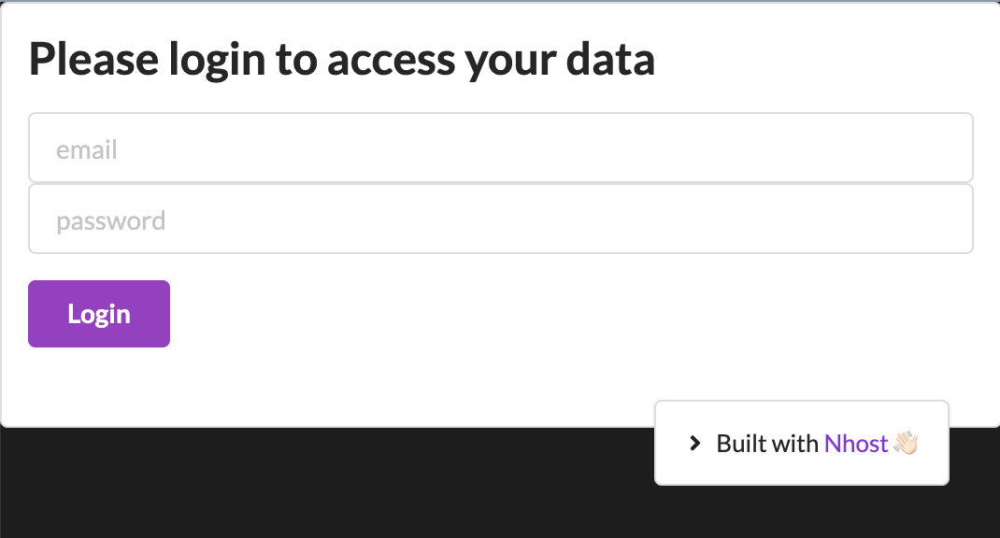

## Project using Nhost, a Jamstack backend with Hasura. 

* Nhost, https://nhost.io/
* PostgreSQL, GraphQL and Hasura, https://hasura.io/
* User management and Storage.
* Form validation

#### Tech used: 
- React
- GraphQL with built-in authorization
- Semantic-UI
- CSS Grid
- VS Code

## View it live
https://distracted-mayer-5b4416.netlify.app/

